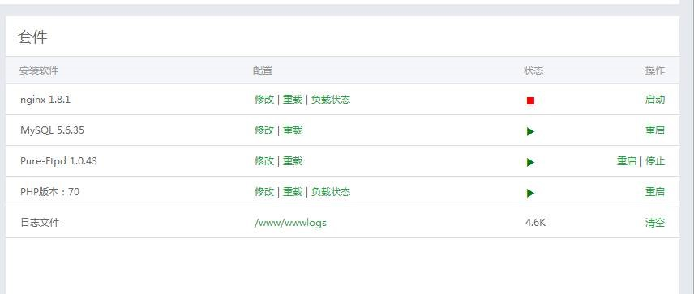

## 准备阶段

* 挑选一台合适的vps，不要用废品vps来试教程。  
* 对vps进行优化，安装锐速或者是bbr这类的vps加速工具。  
* 系统要求：Centos7  

## 安装宝塔管理面板  
* 使用putty工具登陆vps  
* 安装宝塔一建端  
`yum install -y wget && wget -O install.sh http://download.bt.cn/install/install.sh && sh install.sh`  
    
  * 等待安装完成（官网说只要两分钟就可以完成，这个还是要根据服务器性能来确定，我的装了大概4分钟）  
  * 安装完成后，会提示后台登录地址和管理员账号、密码等信息，最好保存下来，然后打开浏览器进行登录。  
    
  * 登陆完成后第一次进入面板，会提示你要安装哪些软件  
    
  * 这里我们选择LNMP, Mysql选择5.5 (低配小鸡), PHP选择7.1 **(必须是这个版本)**, 选择快速安装  
  * 此时，你可以修改一下后台登录密码：面板设置–面板密码，点击修改。  
然后，坐下来休息一下，等待安装完成吧(*^__^*)  
    

## 新建网站  
* 点击“网站”–“添加站点”  
  
* 按照提示创建网站  
  
* 配置nginx  
网站创建成功后，访问域名可以看到创建成功的提示（前提是你绑定的域名也已经解析到当前vps的ip上了，如果没有，请进行解析），接下来，我们进行一些配置。  
  * 点击“网站”–“修改”，进入nginx配置界面  
   
  * 找到配置文件  
      
     * 将  
     root /www/wwwroot/ss.naoxiaogen.com（此处为你的域名）改为  
     root /www/wwwroot/ss.naoxiaogen.com/public  
     在配置文件结尾添加：  
     `location / {`  
     `try_files $uri $uri/ /index.php$is_args$args;`  
     `}`  
     修改后的配置文件：  
       
       

#### 额外事项  
在宝塔面板中找到php，点击设置  
* 在**禁用函数**一栏找到 `system` `proc_open` `proc_get_status` 去除它  
* 在**性能调整**中，把 PHP 运行模式设置为 **静态**  
* 在**配置修改**中 按 Ctrl+F 搜索 `display_errors =` 改为 Off 后保存  

在宝塔面板网站设置中  
* 取消防跨站攻击  

## 安装Nimaqu sspanel   
* 下载 sspanel  
  * 进入我们的网站跟目录
  `cd  /www/wwwroot/[网站目录]`
  * 进行安装  
  `yum install git –y`  
  `git clone -b master https://github.com/Anankke/ss-panel-v3-mod_Uim.git tmp && mv tmp/.git . && rm -rf tmp && git reset --hard`  
    ~~* 注意，`sspanel`的开发团队对目录文件进行了重写。想要使用最新版的`sspanel`请访问~~  
    ~~https://github.com/Anankke/SSPanel-Uim/wiki/%E5%89%8D%E7%AB%AF%E5%AE%89%E8%A3%85~~  
   * 注意，`sspanel`的开发团队对目录文件进行了重写。想要使用最新版的`sspanel`请  
   ```  
   wget https://getcomposer.org/installer -O composer-setup.php  
   php composer-setup.php install  
   php composer.phar install  
   ```  
   或者使用如下命令使用旧版的`sspanel`，该版本已经实现后台直接添加新用户功能，推荐使用。并且该版本是可进行快速安装的最后一个`新`版本  
   ```  
   git reset --hard  
   git checkout 848065d  
   chown -R root:root *  
   chmod -R 755 *  
   chown -R www:www storage  
   php composer.phar install  
   ```
   
      * 关于新版界面问题，不喜欢的小伙伴，请将`../app/Controllers/HomeController.php`中的代码修改如下  
      ```
              return $this->view()  
            ->assign('geetest_html', $GtSdk)  
            ->assign('login_token', $login_token)  
            ->assign('login_number', $login_number)  
            ->assign('telegram_bot', Config::get('telegram_bot'))  
            ->assign('enable_logincaptcha', Config::get('enable_login_captcha'))  
            ->assign('enable_regcaptcha', Config::get('enable_reg_captcha'))  
            ->assign('base_url', Config::get('baseUrl'))  
            ->assign('recaptcha_sitekey', $recaptcha_sitekey)  
            ->display('indexold.tpl');  
      }  
      ```  
  ~~* 使用MyphpAdmin工具建立数据库ss,并建立用户sspanel以及密码1234。 赋予sspanel在ss数据库的完全访问权限。~~  
  然后将 `/网站目录/sql/glzjin_all.sql` 下的数据库导入到ss  

* 配置 sspanel  
  `cd /网站目录`  
  `cp config/.config.php.example config/.config.php`  
  `vi config/.config.php`    //每一个配置项都认真填写  
  `service nginx restart`  

* 创建管理员并同步用户  
  `php xcat createAdmin          //创建管理员`  
  `php xcat syncusers            //同步用户`  
  `php xcat initQQWry            //下载IP解析库`  
  `php xcat resetTraffic         //重置流量`  
  `php xcat initdownload         //下载ssr程式`  

* 设置定时任务  
  执行 crontab -e命令, 添加以下四条  
  ```
  30 22 * * * php /网站目录/xcat sendDiaryMail  
  0 0 * * * php -n /网站目录/xcat dailyjob  
  */1 * * * * php /网站目录/xcat checkjob  
  */1 * * * * php /网站目录/xcat syncnode  
  ```  

* 登录网站  
  * 确认网站是否可以正常登录  
  * 进入管理面板 > 服务器。只有一个服务器的用户，添加当前服务器即可  
  * 进入用户管理，查看是否可以正常显示用户列表  


